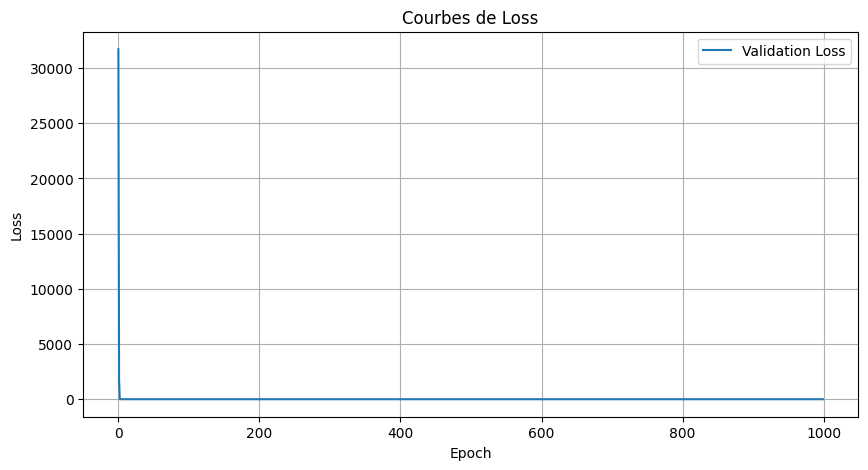
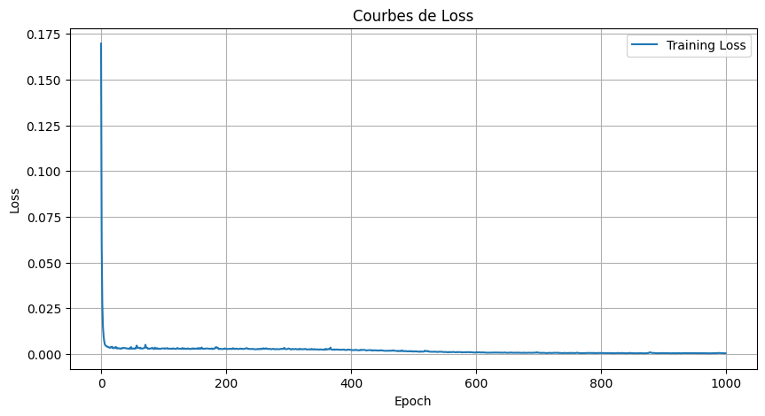
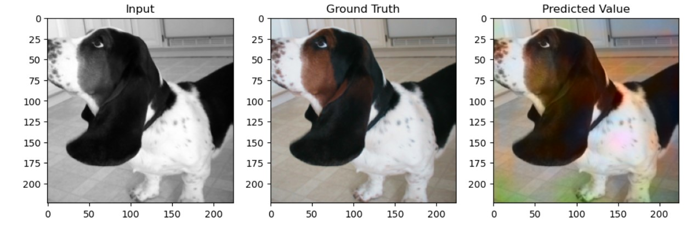
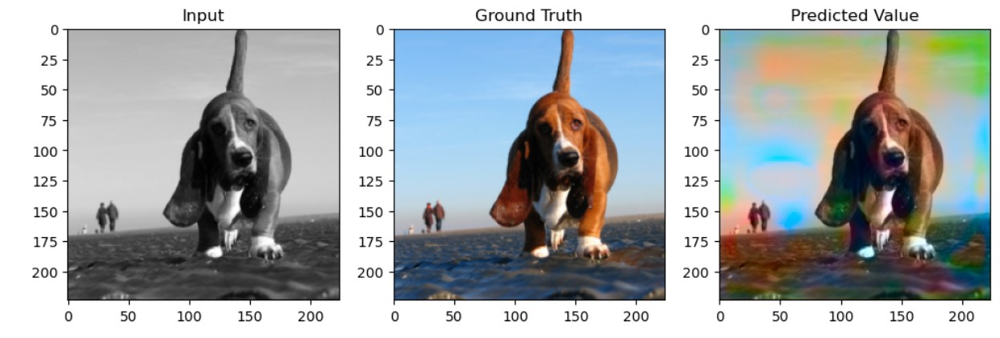
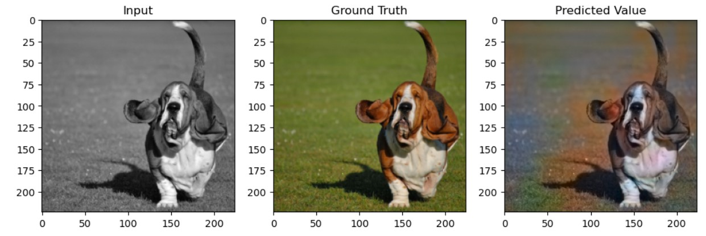

# Colorisation d’Images par Deep Learning

Ce projet repose sur un réseau de neurones convolutifs (CNN) pour coloriser automatiquement des images en niveaux de gris. Il est développé avec PyTorch et entraîné sur un dataset personnalisé d’images RGB, converties dans l’espace de couleur LAB.

## Dataset

Le dataset utilisé est un ensemble d’images RGB compressé dans un fichier `.zip`.

Lien de téléchargement du dataset : [Télécharger le dataset](https://www.kaggle.com/datasets/tanlikesmath/the-oxfordiiit-pet-dataset)  

## Architecture du modèle

Le modèle utilise un backbone pré-entraîné de type `ResNet` provenant de `torchvision.models`, adapté pour une tâche de type image-à-image. L’objectif est de prédire les canaux chromatiques a et b à partir du canal de luminance L dans l’espace LAB.

## Performance de l'entraînement

- La fonction de perte (*loss*), permettant d’évaluer la cohérence de la prédiction par rapport à l’image originale sur l’ensemble d’entraînement.
- La perte de validation, mesurée sur un ensemble d’images non vues par le modèle, permettant d’évaluer sa capacité de généralisation.

## Résultats visuels

Chaque image ci-dessous contient, de gauche à droite :  
image en niveaux de gris, image colorisée (prédite), vérité terrain (RGB).

| Exemples de colorisation |
|---------------------------|
|  |
|  |
|  |

